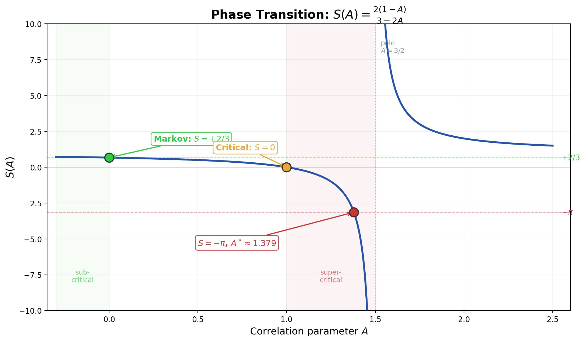

# Reader's Guide: The Trace Anomaly of Binary Multiplication

**Stefano Alimonti** — March 2026

*This guide summarizes the analytical mechanism by which π enters the sector ratio of binary multiplication. It assumes familiarity with the basic setup (carries, D-odd products, sectors) as presented in [P1, Reader's Guide].*

---

## 1. The Decomposition R = R₀ + ΔR

The sector ratio $R(K)$ — the carry-weighted ratio of D-odd pairs in sectors (1,0) and (0,0) — can be computed by two different "readout" methods:

- **Schoolbook:** Read the carry at the fixed position $L - 2$ (second-highest carry). This gives a ratio $R_0 = -3.931205\ldots$, a purely logarithmic constant involving only $\ln 2$ and $\ln 3$.
- **Cascade:** Scan downward from the top, stop at the first nonzero carry, and read one position below. Numerically, this gives strong evidence for $R \to -\pi = -3.14159\ldots$.

The difference $\Delta R = R - R_0 = +0.790\ldots$ is where all the transcendental content lives. The schoolbook limit is proved (Proposition 1); the cascade correction is where the mystery lies.

---

## 2. The Linear Mix Hypothesis (LMH)

The paper proposes a specific mechanism: the effective carry transfer operator decomposes as

$$\mathcal{K}_{\mathrm{eff}} = (1-A) \cdot \mathcal{K}_{\mathrm{Markov}} + \frac{A}{2} \cdot I$$

where $\mathcal{K}_{\mathrm{Markov}}$ is the independent-carry (Markov) operator and $A > 1$ is a scalar parameter measuring the strength of digit correlations. This is a "linear mix" of the Markov operator with a pure-noise term.

Under the LMH, the effective eigenvalues of the carry bridge become

$$\lambda_n^{\mathrm{eff}} = (1 - A) \cdot \frac{1}{2}\cos\!\left(\frac{n\pi}{L}\right) + \frac{A}{2}$$

and the corresponding effective spectral sum is the closed-form Möbius transformation

$$S(A) = \frac{2(1-A)}{3-2A}$$

proved in [P1, Theorem 1]. If the physical cascade ratio is governed by the LMH/resolvent-universality model of [E], this identifies the observed sector ratio with $S(A)$.

---

## 3. The Phase Transition

| $A$ | $S(A)$ | Interpretation |
|-----|-----------|----------------|
| 0 | +2/3 | Markov (no correlations): rational, positive |
| 1 | 0 | Critical point: exact cancellation |
| $A^* \approx 1.379$ | $-\pi$ | LMH value matching the observed limit |
| 3/2 | $\pm\infty$ | Pole (divergence) |

Within the LMH model, as digit correlations increase from $A = 0$ to $A^*$, the spectral sum crosses zero and reaches $-\pi$. This places the model at distance $1/(2(\pi + 1)) \approx 0.121$ from the pole — remarkably close to divergence.

---

## 4. Three Falsification Results

To test the LMH against the main alternatives, the paper systematically falsifies several competing explanations:

**Falsification 1 (Boundary geometry).** If $\pi$ came from the D-parity boundary curve $\alpha + \beta = \pi/4$ [G], it should be localized in pairs near the boundary. Decomposing contributions by boundary proximity (through depth 12) shows that $\pi$ is *not* concentrated at the boundary — it is distributed across the full domain (Observation 2).

**Falsification 2 (Critical cell area).** The cell where the cascade correction $\Delta R$ peaks has area $-3/16 + 7/4 \cdot \ln(28/25)$, a rational combination of logarithms with no $\pi$ (Proposition 3). The transcendental content enters through the *weighting* of cells, not their geometry.

**Falsification 3 (Generic operators).** No diagonal perturbation of a cosine-spectrum operator can reproduce the Linear Mix — the trace obstruction prevents it (Observation 4). The LMH requires a specific off-diagonal structure that mirrors the Diaconis-Fulman carry dynamics.

---

## 5. The Resolvent Universality Mechanism

Under the LMH/resolvent-universality model, the relevant spectral sum is taken over the Dirichlet eigenmodes of the carry bridge. In the $L \to \infty$ limit, the spectral weights $\sin(n\pi/2)$ (for $n \geq 1$) coincide with the Dirichlet character $\chi_4(n) = (1, 0, -1, 0, 1, 0, -1, \ldots)$ restricted to the odd modes $n = 1, 3, 5, \ldots$ that carry the alternating sign. The resulting sum

$$\sum_{k=0}^{\infty} \frac{(-1)^k}{1/2 + \beta \sin^2((2k+1)\pi/(2L))}$$

converges to $2\beta/(1 + 2\beta)$ (proved). Choosing $\beta = -\pi/(2+2\pi)$, equivalently $A = A^*$, makes this model sum equal to $-\pi$.

The key insight: no single Fourier mode carries the $\pi$-content. Instead, the **resolvent** — the inverse $(I - \lambda T)^{-1}$ of the transfer operator — redistributes the spectral weight collectively. In the proposed universality mechanism, $-\pi$ emerges from the *collective behavior* of all modes, not from any individual one.

---

## 6. What Remains Open

The paper leaves two explicit closure points in the proposed LMH/resolvent-universality mechanism:

1. **The effective $\chi_4$-channel closure:** Prove that the LMH/resolvent-universality mechanism fixes the effective $\chi_4$-channel constant so that the model sum matches $-\pi$ (equivalently, the closure corresponding to $A = A^*$).

2. **Spectral gap preservation:** Prove that the Diaconis-Fulman spectral gap $\rho = 1/2$ is preserved when the carry chain is conditioned on the D-odd constraint ($c_0 = c_L = 0$).

Both are analytically tractable targets. The first now has a precise operator-side formulation in [L]: the mixed stopping-time channel is realized as a canonical weighted first-return resolvent and its $s=1$ closure reduces to a scalar `χ₄ -> L(1,\chi_4)` constant. The second requires a perturbation argument for the boundary-conditioned transfer operator. The same companion analysis shows that the present carry-side object remains zero-free in the tested strip box and does not admit a simple gamma-like completion there, so the missing ingredient is not another fit but a genuine phase/completion mechanism.

---

## References

1. [P1] S. Alimonti, "π from Pure Arithmetic: A Spectral Phase Transition in the Binary Carry Bridge," this series. doi:[10.5281/zenodo.18895611](https://doi.org/10.5281/zenodo.18895611) — [GitHub](https://github.com/stefanoalimonti/carry-arithmetic-P1-pi-spectral)
2. [A] S. Alimonti, "Spectral Theory of Carries in Positional Multiplication," this series. doi:[10.5281/zenodo.18895593](https://doi.org/10.5281/zenodo.18895593) — [GitHub](https://github.com/stefanoalimonti/carry-arithmetic-A-spectral-theory)
3. [G] S. Alimonti, "The Angular Uniqueness of Base 2 in Positional Multiplication," this series. doi:[10.5281/zenodo.18895601](https://doi.org/10.5281/zenodo.18895601) — [GitHub](https://github.com/stefanoalimonti/carry-arithmetic-G-angular-uniqueness)
4. [L] S. Alimonti, "The Carry–Dirichlet Bridge: Stopping-Time Series and L²(s,χ₄)," this series. doi:[10.5281/zenodo.18895609](https://doi.org/10.5281/zenodo.18895609) — [GitHub](https://github.com/stefanoalimonti/carry-arithmetic-L-dirichlet-bridge)

---

*CC BY 4.0*
